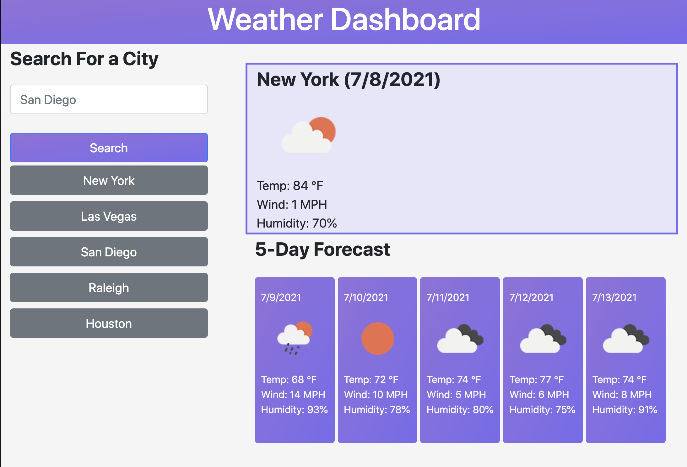

# Weather On the Dash

## Table of Contents
- [Description](#description)
- [Installation](#installation)
- [Usage](#usage)
- [Technology](#technology)
- [Contact](#contact)

# Description
Among the many technological advances that have shaped human history, none has been more impactful than man's ability to forecast weather conditions. In war, the ability to predict and use weather as an advantage can mean the difference between victory and defeat on the battlefield. Farmers depend on weather forecasts for crop production, while others use forecasting to plan leisurely activities. Today, with global warming on the rise, the ability to attain clear, accurate, and up to date weather forecasts is at an all time high. 
 
Weather On the Dash is a weather application that allows users to check current and future weather conditions for a chosen city. The application features prominent displays for temperature, wind speed and humidity, and utilizes local storage to save user's search history. The responsive design of this web application is mobile friendly, enabling users to receive up to date weather forecasts, both at home and on the go. No matter the user, Weather On the Dash is guaranteed to provide reliable weather conditions to meet their specific needs.
 

# Installation
No installation required. Please see link to the deployed application:

* Deployed Application - https://mandellbutler.github.io/Weather-on-the-Dash/

# Usage

* Upon page loading, the user is presented with a weather dashboard with form inputs.
* Upon entering a city name into the input field, the user is presented with weather conditions for that city.
* User is presented with current and future weather conditions, including Temperature, Wind Speed and Humidity.
* Application uses local storage to store searched cities.
* When the user clicks on a saved city, they are, again, presented with current and future conditions for that city.
* The screen is reactive, adapting to both mobile and larger screen layouts.

### Responsive Design:

# Technology
The design of this application was made possible with the following Development Tools:

* Moment.js 
* Vanilla Javascript
* Bootstrap

# Contact

Please feel free to contact me, should you have any questions!

* <a href="https://github.com/mandellbutler">

* <a href="https://www.linkedin.com/in/mandellbutler/">

* Email: mandell.butler@outlook.com